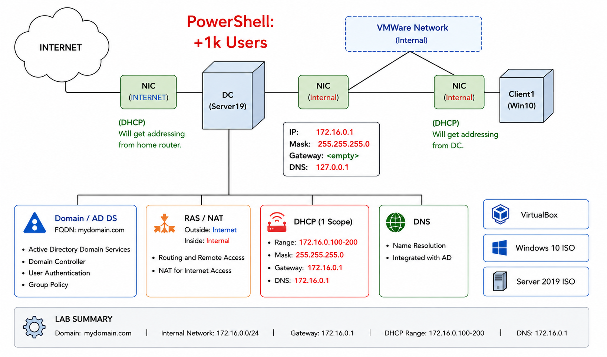

# Active Directory Home Lab

## Overview

This project demonstrates the deployment of a Windows Server 2019 Active Directory environment in VirtualBox. The lab includes Active Directory Domain Services (AD DS), DNS, DHCP, Routing and Remote Access (RRAS/NAT), a Windows 10 client joined to the domain, and PowerShell automation used to create over 1,000 user accounts.

---

## Network Topology

The lab environment consists of a Windows Server 2019 Domain Controller and a Windows 10 client connected through an internal network.



---

## Server Configuration

Windows Server 2019 was configured with the following services:

- Active Directory Domain Services (AD DS)
- DNS
- DHCP
- Routing and Remote Access (RRAS/NAT)


---

## Domain Controller Configuration

The server was promoted to a Domain Controller for the domain:

**mydomain.com**

The Domain Controller handles authentication, authorization, DNS services, and Active Directory management.


---

## PowerShell User Automation

A PowerShell script was used to automatically create over 1,000 Active Directory user accounts from a text file.

Files used:

- Create-Users.ps1
- names.txt

This automation simulates a real-world enterprise environment where large numbers of user accounts must be provisioned efficiently.


---

## Active Directory User Management

The PowerShell script successfully created user accounts inside the _USERS Organizational Unit.

This demonstrates bulk user provisioning and Active Directory administration.


---

## DHCP Configuration

A DHCP scope was configured to automatically assign IP addresses to domain clients.

DHCP Scope:

- Network: 172.16.0.0/24
- DHCP Range: 172.16.0.100 - 172.16.0.200
- DNS Server: 172.16.0.1


---

## Routing and Remote Access (RRAS/NAT)

Routing and Remote Access Services (RRAS) was configured to provide Network Address Translation (NAT).

This allows internal clients to access external networks through the Domain Controller.


---

## Domain-Joined Client

A Windows 10 client workstation was successfully joined to the Active Directory domain.

The computer object appears within Active Directory and can be managed centrally.


---

## Successful Domain Login

The Windows 10 workstation successfully authenticated against the Domain Controller and logged into the domain.

Full device name:

**CLIENT1.mydomain.com**


---

## Skills Demonstrated

- Active Directory Administration
- Windows Server 2019
- DNS Configuration
- DHCP Configuration
- Routing and Remote Access (RRAS)
- Network Address Translation (NAT)
- PowerShell Scripting
- Bulk User Provisioning
- Windows 10 Domain Join
- User Authentication
- VirtualBox Virtualization
- Windows Server Management
- Network Troubleshooting

---

## Project Structure

```text
Active-Directory-Lab/
│
├── README.md
│
├── Screenshots/
│   ├── active-directory-users.png
│   ├── client-domain-object.png
│   ├── client-domain-joined.png
│   ├── dhcp-leases.png
│   ├── domain-controller.png
│   ├── network-diagram.png
│   ├── powershell-user-creation.png
│   ├── rras-nat.png
│   └── server-overview.png
│
└── Scripts/
    ├── Create-Users.ps1
    └── names.txt
```

